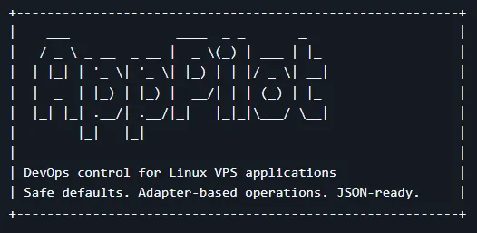

<!--
  LucasLydio GitHub Profile
  Direction: vertical, illustration-led, no table/flex grid
  Free illustrations: unDraw (https://undraw.co/license)
-->
## Hello!

  
   

**Hi, I'm Lucas — a Full Stack Developer who likes building reliable systems and keeping things fun while shipping.**  

I enjoy working across the full flow:  
**backend architecture → frontend experience → CI/CD → production reliability**

When I’m coding, I’m usually thinking about how to make software more:
**clear, scalable, testable, and easier to operate**.

<a href="https://github.com/LucasLydio?tab=repositories">
  Explore my repositories →
</a>

# Stack

## Backend

I build APIs, authentication flows, integrations and backend services with clear boundaries and maintainable architecture.

`TypeScript` · `JavaScript` · `Node.js` · `Express` · `NestJS`

`Java` · `Spring Boot` · `Hibernate` · `Maven` · `Gradle` · `JUnit`

**Core:** REST APIs · JWT · Refresh Tokens · OAuth2 · RBAC · Clean Architecture · SOLID

---

## Frontend

Responsive web applications connected to real APIs, with reusable interfaces and predictable application flows.

`Angular` · `React` · `RxJS` · `Vite`

`HTML` · `CSS` · `Sass` · `Bootstrap` · `Tailwind CSS`

**Focus:** Responsive UI · Accessibility · API integration · State management

---

## Data & Performance

Relational persistence and caching strategies focused on consistency, maintainability and application performance.

`PostgreSQL` · `Prisma` · `Redis`

**Focus:** Data modeling · Migrations · Transactions · Redis caching · Query performance

---

## Testing & Quality

Testing belongs inside the development lifecycle instead of being something added immediately before release.

`Jest` · `Vitest` · `Cypress` · `Playwright` · `JUnit`

`ESLint` · `Prettier`

**Strategy:** Unit → Integration → E2E

---

## DevOps, Cloud & Observability

I like reproducible environments, automated delivery and systems that expose enough signals to diagnose failures.

`Docker` · `GitHub Actions` · `Nginx` · `Terraform`

`AWS` · `Netlify` · `Vercel`

`Grafana` · `Prometheus`

**Operations:** CI/CD · Logs · Metrics · Health Checks · Dockerized Environments

---

# Featured projects

## 🚀 Visual Pipeline

**CI/CD as a visual experience.**

A developer-focused platform exploring the path from repository events to builds, deployments and runtime feedback.

`Node.js` · `TypeScript` · `PostgreSQL` · `Prisma` · `Redis` · `Docker`

[Explore repositories →](https://github.com/LucasLydio?tab=repositories)

---

## 🛰️ AppPilot

**Infrastructure and deployment automation from the command line.**

 

A DevOps CLI for repeatable server setup, deployment and operational workflows across VPS environments.

`Docker` · `Nginx` · `Linux` · `SSL` · `Deployment Automation`

[Explore repositories →](https://github.com/LucasLydio?tab=repositories)

---

---

# Engineering interests

`Backend Architecture` · `Distributed Systems` · `Developer Tooling`

`Cloud Infrastructure` · `CI/CD` · `Observability`

`System Reliability` · `Software Testing` · `Automation`

---

# GitHub activity

<picture>
  <source
    media="(prefers-color-scheme: dark)"
    srcset="https://streak-stats.demolab.com?user=LucasLydio&theme=github-dark-blue&hide_border=true"
  />
  
</picture>

  

---

## Ready for the next build.

**BUILD CLEARLY · SHIP RELIABLY · KEEP IMPROVING**

 

<a href="https://github.com/LucasLydio">GitHub</a>
&nbsp;·&nbsp;
<a href="https://github.com/LucasLydio?tab=repositories">Projects</a>

  

Illustrations by unDraw. Used under the unDraw license.

