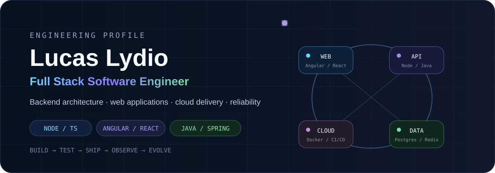
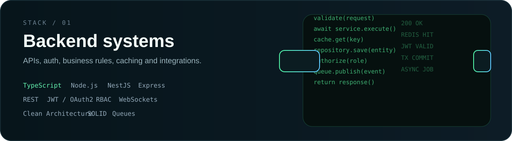
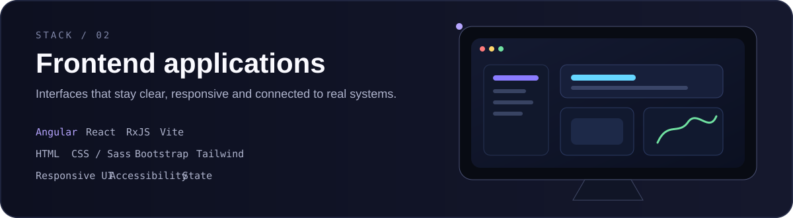
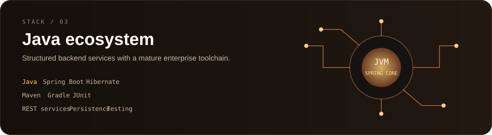
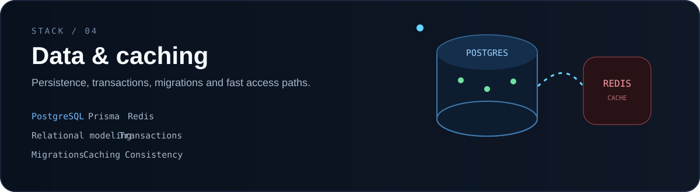
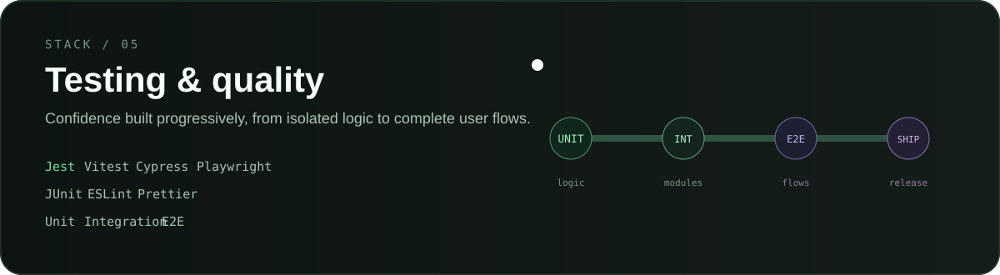
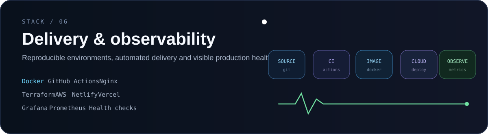

 

**I build software across the complete delivery path — application code, data, infrastructure and production reliability.**

`REST APIs` · `Web Applications` · `Authentication` · `Caching` · `CI/CD` · `Testing` · `Observability`

 

## Engineering stack

 

 

 

 

 

 

## What I care about

I like systems that are **easy to understand, test, deploy, observe and evolve**.

My engineering interests include backend architecture, distributed systems, developer tooling, cloud infrastructure, CI/CD, software testing and system reliability.

 

## Current work

**Visual Pipeline** — exploring a visual CI/CD experience from repository events to Docker builds, deployments and runtime feedback.

**AppPilot** — building a DevOps CLI for repeatable server setup, application deployment and operational workflows.

**Webhook Reliability Hub** — exploring resilient webhook processing with queues, retries, provider strategies and failure recovery.

 

### Build clearly. Ship reliably. Keep improving.

<a href="https://github.com/LucasLydio?tab=repositories">Explore my repositories</a>

