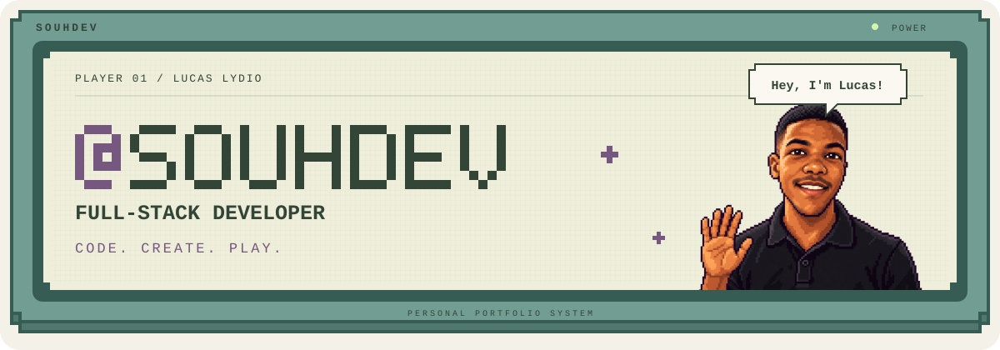
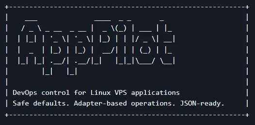

<!--
  LucasLydio GitHub Profile
  Brand: @souhdev / Lucas Lydio
  Visual system: pixel-console, warm paper, teal hardware, deep ink, plum accent.
-->

# Hi, I'm Lucas - @souhdev

**Full-stack developer. Curious by default. Building one level at a time.**

[Explore my repositories ->](https://github.com/LucasLydio?tab=repositories) | [LinkedIn](https://www.linkedin.com/in/lucas-lydio-8231b436b/) | [Email](mailto:lucaslydiodev26@gmail.com)

---

## 01 / Player profile

I build web applications, APIs, and integrations, working across **interfaces,
data, testing, deployment, and observability**. My background in technical support
keeps me close to the people and production systems behind the code.

I care about software that is easy to **understand -> test -> deploy -> observe -> evolve**.

Around here, you'll find the projects I'm building and the tools I'm learning.
On social media, I'm **@souhdev**, sharing my corner of development with fellow
developers and tech teams.

---

## 02 / Developer inventory

### Backend system

  
  
  
  
  

APIs, authentication flows, integrations, and backend services with clear
boundaries and maintainable architecture.

**Focus:** REST APIs | JWT | Refresh Tokens | OAuth2 | RBAC | Clean Architecture | SOLID

### Frontend interface

  
  
  
  
  

Responsive web applications connected to real APIs, with reusable interfaces and
predictable application flows.

**Focus:** Responsive UI | Accessibility | API integration | State management

### Data and performance

  
  
  

Relational persistence and caching strategies focused on consistency,
maintainability, and application performance.

**Focus:** Data modeling | Migrations | Transactions | Redis caching | Query performance

### Testing and quality

  
  
  
  
  

Testing belongs inside the development lifecycle, from isolated behavior to
end-to-end confidence.

**Strategy:** Unit -> Integration -> E2E

### Delivery and observability

  
  
  
  
  

Reproducible environments, automated delivery, and systems that expose enough
signals to diagnose failures.

**Operations:** CI/CD | Logs | Metrics | Health checks | Dockerized environments

---

## 03 / Selected quests

### Visual Pipeline

**CI/CD as a visual experience.**

A developer-focused platform exploring the path from repository events to builds,
deployments, and runtime feedback.

`Node.js` | `TypeScript` | `PostgreSQL` | `Prisma` | `Redis` | `Docker`

[Explore repositories ->](https://github.com/LucasLydio?tab=repositories)

### AppPilot

**Infrastructure and deployment automation from the command line.**

A DevOps CLI for repeatable server setup, deployment, and operational workflows
across VPS environments.

`Docker` | `Nginx` | `Linux` | `SSL` | `Deployment Automation`

[Explore repositories ->](https://github.com/LucasLydio?tab=repositories)

---

## 04 / Side quests

`Backend Architecture` | `Distributed Systems` | `Developer Tooling`

`Cloud Infrastructure` | `CI/CD` | `Observability`

`System Reliability` | `Software Testing` | `Automation`

---

## 05 / GitHub activity

<picture>
  <source
    media="(prefers-color-scheme: dark)"
    srcset="https://streak-stats.demolab.com?user=LucasLydio&hide_border=true&background=334536&ring=719D93&fire=75577F&currStreakLabel=EEEEDA&sideLabels=EEEEDA&dates=F4F1E8&currStreakNum=719D93&sideNums=719D93"
  />
  
</picture>

  

<picture>
  <source
    media="(prefers-color-scheme: dark)"
    srcset="https://github-readme-activity-graph.vercel.app/graph?username=LucasLydio&bg_color=334536&color=EEEEDA&line=719D93&point=75577F&area=true&area_color=719D93&title_color=EEEEDA&hide_border=true"
  />
  
</picture>

---

## Continue?

**BUILD CLEARLY | SHIP RELIABLY | KEEP IMPROVING**

 

<a href="https://github.com/LucasLydio">GitHub</a>
&nbsp;|&nbsp;
<a href="https://github.com/LucasLydio?tab=repositories">Projects</a>
&nbsp;|&nbsp;
<a href="https://www.linkedin.com/in/lucas-lydio-8231b436b/">LinkedIn</a>

